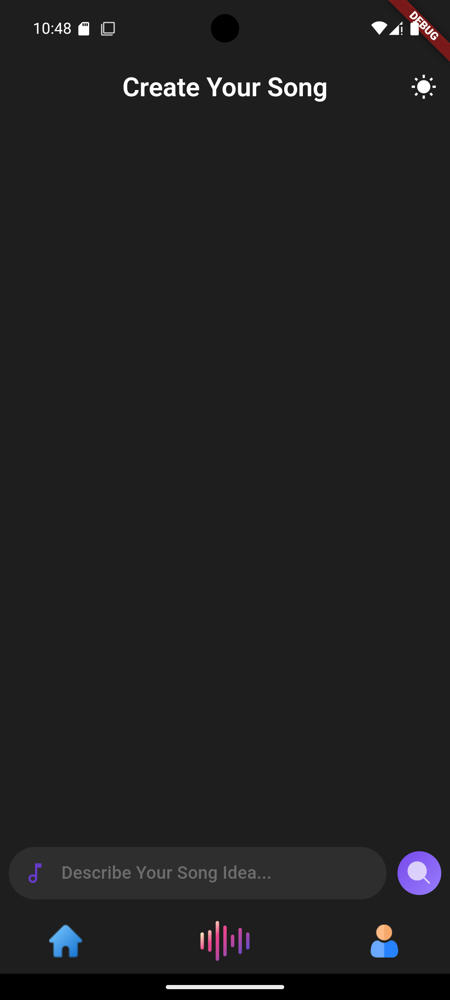

# songgpt

SongGPT is a Flutter-based mobile application designed to help users create and explore songs using AI-generated suggestions and a rich library of predefined content.

## Features
<video src="images/screen-20241027-084239.mp4" controls="controls" width="600" height="400"></video>
- **Home Screen**: Browse and search for songs.
- 
- 
- **AI Chat**: Interact with an AI to generate song ideas.
- 


- **Song Detail Screen**: View detailed information about songs, including cover art, basic information, and lyrics.
- 
- 
- **Profile Screen**: Manage user profiles, liked songs, and user-generated songs.
- 
- 
## Installation

1. **Clone the repository**:
    git clone https://github.com/yourusername/SongGPT.git
    cd SongGPT
2. **Install dependencies**:
    flutter pub get
3. **Run the app**:
    ```sh
    flutter run
    ```

## Folder Structure

lib/ |- core/ | |- theme/ | | |- app_colors.dart | | |- app_fonts.dart | | |- theme.dart | | |- theme_notifier.dart | |- widgets/ | |- custom_app_bar.dart |- data/ | |- models/ | | |- song_model.dart | |- providers/ | |- auth_provider.dart | |- chat_provider.dart | |- navigation_provider.dart | |- repositories/ | |- song_repository.dart |- presentation/ | |- screens/ | | |- home_screen.dart | | |- chat_screen.dart | | |- song_detail_screen.dart | | |- profile_screen.dart | |- widgets/ | |- custom_textfield.dart | || |- main.dart
